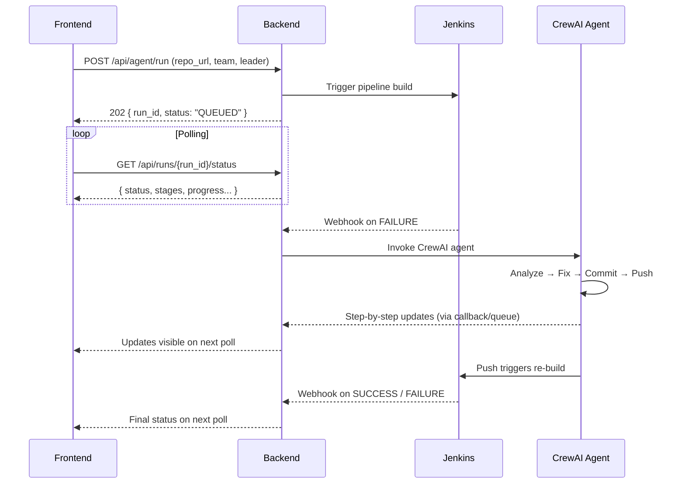

# Backend API Endpoints for CI/CD Auto-Healing Agent

## Architecture Flow



---

## Endpoints

### 1. Trigger Agent Run

| | |
|---|---|
| **Method** | `POST` |
| **Path** | `/api/agent/run` |
| **Purpose** | Frontend submits repo URL + team info; backend clones repo, triggers Jenkins pipeline, and starts the agent loop |
| **Called from** | [Home.tsx](file:///c:/Users/gideon/codespace/cicd-auto-healing-agent/frontend/src/pages/Home.tsx) — "Run Agent" button |

**Request Body**
```json
{
  "repo_url": "https://github.com/user/repo",
  "team_name": "RIFT ORGANISERS",
  "team_leader": "Saiyam Kumar"
}
```

**Response** `202 Accepted`
```json
{
  "run_id": "uuid-v4",
  "status": "QUEUED",
  "branch_name": "RIFT_ORGANISERS_SAIYAM_KUMAR_AI_Fix",
  "created_at": "2026-02-20T00:00:00Z"
}
```

---

### 2. Poll Run Status (Primary polling endpoint)

| | |
|---|---|
| **Method** | `GET` |
| **Path** | `/api/runs/{run_id}/status` |
| **Purpose** | Frontend polls this to get the live state of the entire run — CI/CD stage progress, agent activity, and overall result |
| **Called from** | [RepoPage.tsx](file:///c:/Users/gideon/codespace/cicd-auto-healing-agent/frontend/src/pages/RepoPage.tsx) — on an interval (e.g. every 3s) |

**Response** `200 OK`
```json
{
  "run_id": "uuid",
  "status": "RUNNING | AGENT_FIXING | PASSED | FAILED",
  "repo_url": "https://github.com/user/repo",
  "team_name": "RIFT ORGANISERS",
  "team_leader": "Saiyam Kumar",
  "branch_name": "RIFT_ORGANISERS_SAIYAM_KUMAR_AI_Fix",

  "summary": {
    "total_failures_detected": 7,
    "total_fixes_applied": 6,
    "final_cicd_status": "PASSED | FAILED | RUNNING",
    "total_time_seconds": 245,
    "started_at": "2026-02-20T00:00:00Z",
    "finished_at": "2026-02-20T00:04:05Z"
  },

  "score": {
    "base": 100,
    "speed_bonus": 10,
    "efficiency_penalty": -4,
    "total": 106,
    "total_commits": 22
  },

  "current_iteration": 3,
  "max_iterations": 5,

  "pipeline_stages": [
    {
      "name": "Clone",
      "status": "SUCCESS",
      "started_at": "...",
      "finished_at": "..."
    },
    {
      "name": "Install Dependencies",
      "status": "SUCCESS",
      "started_at": "...",
      "finished_at": "..."
    },
    {
      "name": "Run Tests",
      "status": "FAILED",
      "started_at": "...",
      "finished_at": "...",
      "error_log": "FAILED: test_validator.py::test_parse ..."
    }
  ],

  "agent_steps": [
    {
      "step": 1,
      "action": "Analyzing test failures",
      "status": "DONE",
      "timestamp": "..."
    },
    {
      "step": 2,
      "action": "Fixing SYNTAX error in src/validator.py line 8",
      "status": "IN_PROGRESS",
      "timestamp": "..."
    }
  ]
}
```

---

### 3. Get Fixes Applied

| | |
|---|---|
| **Method** | `GET` |
| **Path** | `/api/runs/{run_id}/fixes` |
| **Purpose** | Returns the table of all fixes applied by the agent (maps to the "Fixes Applied Table" in the RIFT spec) |
| **Called from** | RepoPage — Fixes Applied Table section |

**Response** `200 OK`
```json
{
  "fixes": [
    {
      "file": "src/utils.py",
      "bug_type": "LINTING",
      "line_number": 15,
      "description": "Remove unused import 'os'",
      "commit_message": "[AI-AGENT] Remove unused import os in src/utils.py",
      "commit_sha": "abc1234",
      "status": "FIXED",
      "iteration": 1
    },
    {
      "file": "src/validator.py",
      "bug_type": "SYNTAX",
      "line_number": 8,
      "description": "Add missing colon",
      "commit_message": "[AI-AGENT] Fix missing colon in src/validator.py",
      "commit_sha": "def5678",
      "status": "FIXED",
      "iteration": 1
    }
  ]
}
```

---

### 4. Get CI/CD Timeline

| | |
|---|---|
| **Method** | `GET` |
| **Path** | `/api/runs/{run_id}/timeline` |
| **Purpose** | Returns the CI/CD iteration history — each Jenkins pipeline run with pass/fail and timestamps (maps to "CI/CD Status Timeline" in the RIFT spec) |
| **Called from** | RepoPage — CI/CD Timeline visualization |

**Response** `200 OK`
```json
{
  "iterations": [
    {
      "iteration": 1,
      "status": "FAILED",
      "started_at": "2026-02-20T00:00:30Z",
      "finished_at": "2026-02-20T00:01:45Z",
      "failures_found": 7,
      "fixes_applied": 5,
      "jenkins_build_url": "http://jenkins/job/repo/1"
    },
    {
      "iteration": 2,
      "status": "FAILED",
      "started_at": "2026-02-20T00:02:00Z",
      "finished_at": "2026-02-20T00:03:10Z",
      "failures_found": 2,
      "fixes_applied": 2,
      "jenkins_build_url": "http://jenkins/job/repo/2"
    },
    {
      "iteration": 3,
      "status": "PASSED",
      "started_at": "2026-02-20T00:03:25Z",
      "finished_at": "2026-02-20T00:04:05Z",
      "failures_found": 0,
      "fixes_applied": 0,
      "jenkins_build_url": "http://jenkins/job/repo/3"
    }
  ],
  "current_iteration": 3,
  "max_iterations": 5
}
```

---

### 5. List Repositories (Sidebar)

| | |
|---|---|
| **Method** | `GET` |
| **Path** | `/api/repos` |
| **Purpose** | Returns all repos that have been submitted for agent runs (replaces the hardcoded `REPOS` array in the Sidebar) |
| **Called from** | [Sidebar.tsx](file:///c:/Users/gideon/codespace/cicd-auto-healing-agent/frontend/src/components/Sidebar.tsx) |

**Response** `200 OK`
```json
{
  "repos": [
    {
      "name": "cicd-auto-healing-agent",
      "repo_url": "https://github.com/gideon/cicd-auto-healing-agent",
      "latest_run_id": "uuid",
      "latest_status": "PASSED",
      "created_at": "..."
    }
  ]
}
```

---

### 6. List Builds for a Repo (Project Sidebar)

| | |
|---|---|
| **Method** | `GET` |
| **Path** | `/api/repos/{repo_name}/builds` |
| **Purpose** | Returns the list of all agent runs/builds for a specific repo (replaces the hardcoded `BUILDS` array in ProjectSidebar) |
| **Called from** | [ProjectSidebar.tsx](file:///c:/Users/gideon/codespace/cicd-auto-healing-agent/frontend/src/components/ProjectSidebar.tsx) |

**Response** `200 OK`
```json
{
  "builds": [
    {
      "run_id": "uuid",
      "build_number": 1024,
      "status": "FAILED",
      "branch_name": "RIFT_ORGANISERS_SAIYAM_KUMAR_AI_Fix",
      "started_at": "...",
      "finished_at": "..."
    }
  ]
}
```

---

### 7. Get Results JSON

| | |
|---|---|
| **Method** | `GET` |
| **Path** | `/api/runs/{run_id}/results` |
| **Purpose** | Returns the `results.json` file generated at the end of each run (mandatory per RIFT spec) |
| **Called from** | Download / export functionality |

**Response** `200 OK` — returns the `results.json` content directly.

---

### 8. Jenkins Webhook Receiver (Backend-only, not called by frontend)

| | |
|---|---|
| **Method** | `POST` |
| **Path** | `/api/webhooks/jenkins` |
| **Purpose** | Jenkins calls this on build completion. Backend uses this to determine if the agent should be invoked (on failure) or if the run is complete (on success) |

**Request Body** (from Jenkins)
```json
{
  "build_number": 1024,
  "status": "SUCCESS | FAILURE",
  "repo_url": "https://github.com/user/repo",
  "branch": "RIFT_ORGANISERS_SAIYAM_KUMAR_AI_Fix",
  "log_url": "http://jenkins/job/repo/1024/console",
  "timestamp": "..."
}
```

---

## Summary Table

| # | Method | Endpoint | Direction | Purpose |
|---|--------|----------|-----------|---------|
| 1 | `POST` | `/api/agent/run` | FE → BE | Trigger a new agent run |
| 2 | `GET` | `/api/runs/{run_id}/status` | FE → BE | Poll overall run status |
| 3 | `GET` | `/api/runs/{run_id}/fixes` | FE → BE | Get fixes applied table |
| 4 | `GET` | `/api/runs/{run_id}/timeline` | FE → BE | Get CI/CD iteration timeline |
| 5 | `GET` | `/api/repos` | FE → BE | List all submitted repos |
| 6 | `GET` | `/api/repos/{repo_name}/builds` | FE → BE | List builds for a repo |
| 7 | `GET` | `/api/runs/{run_id}/results` | FE → BE | Download results.json |
| 8 | `POST` | `/api/webhooks/jenkins` | Jenkins → BE | Pipeline completion callback |

> [!TIP]
> Endpoints 2, 3, and 4 could be consolidated into a single endpoint that returns the full run object if you want to reduce polling requests. They're separated here for clarity and to match the distinct UI sections in the RIFT spec.

> [!IMPORTANT]
> The **Jenkins → Backend webhook** (#8) is the key mechanism that drives the feedback loop. When Jenkins reports a failure, the backend invokes the CrewAI agent. When Jenkins reports success, the backend marks the run as `PASSED` and the frontend picks it up on the next poll.
